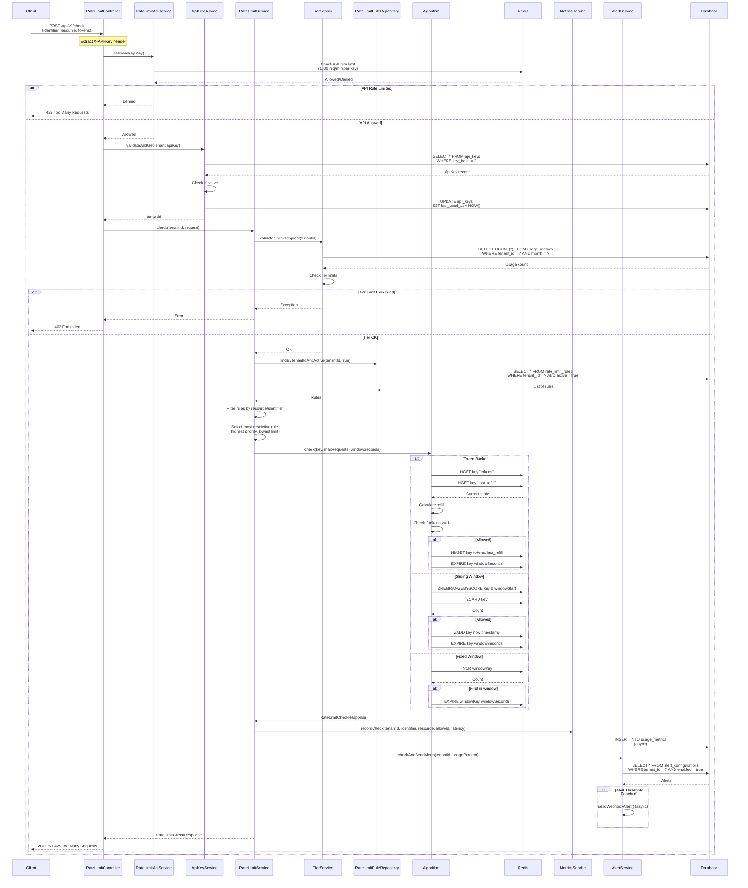
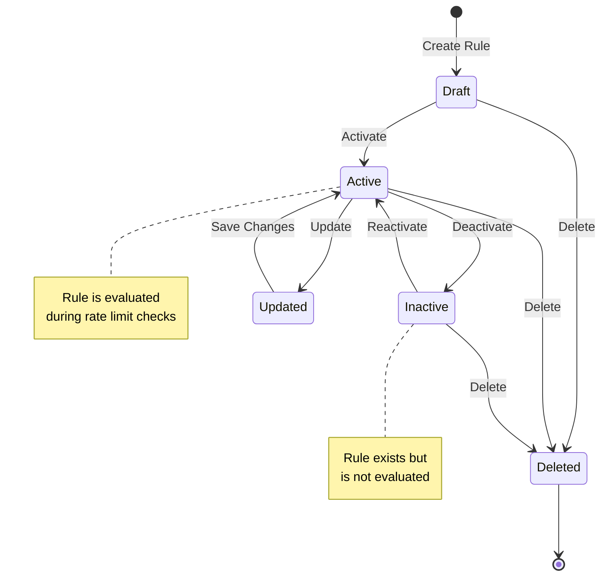
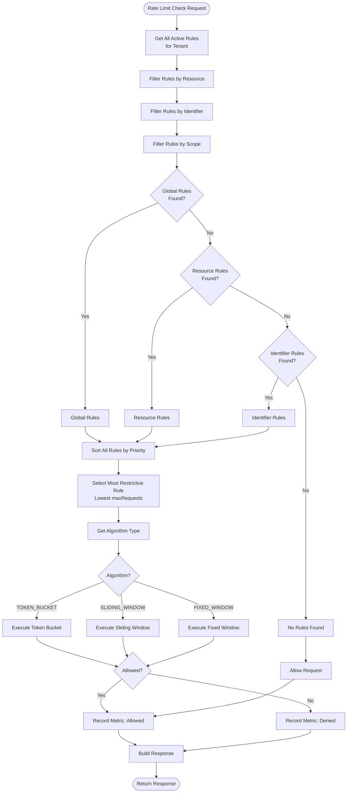
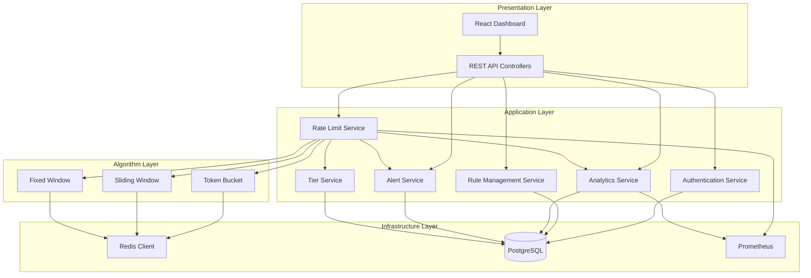

# UML Diagrams - RateLimitX

This document contains detailed UML diagrams for the RateLimitX system.

---

## Class Diagram - Complete System

```mermaid
classDiagram
    %% Controllers
    class RateLimitController {
        -RateLimitService rateLimitService
        -ApiKeyService apiKeyService
        -RateLimitApiService rateLimitApiService
        +check(String apiKey, RateLimitCheckRequest) RateLimitCheckResponse
    }
    
    class AuthController {
        -AuthService authService
        +register(RegisterRequest) ApiResponse
        +login(LoginRequest) ApiResponse
        +refresh(RefreshRequest) ApiResponse
    }
    
    class RuleController {
        -RateLimitRuleRepository ruleRepository
        -TierService tierService
        +getRules() ApiResponse~List~RateLimitRule~~
        +createRule(CreateRuleRequest) ApiResponse~RateLimitRule~
        +updateRule(UUID, UpdateRuleRequest) ApiResponse~RateLimitRule~
        +deleteRule(UUID) ApiResponse~Void~
    }
    
    class ApiKeyController {
        -ApiKeyService apiKeyService
        +getApiKeys() ApiResponse~List~ApiKey~~
        +createApiKey(CreateApiKeyRequest) ApiResponse~Map~
        +deleteApiKey(UUID) ApiResponse~Void~
        +rotateApiKey(UUID) ApiResponse~Map~
    }
    
    class AnalyticsController {
        -UsageMetricRepository metricsRepository
        -TierService tierService
        +getRealtime() ApiResponse~Map~
        +getTopIdentifiers(int) ApiResponse~List~
        +getTrends(String, String) ApiResponse~Map~
    }
    
    class AlertController {
        -AlertConfigurationRepository alertRepository
        +getAlerts() ApiResponse~List~AlertConfiguration~~
        +createAlert(CreateAlertRequest) ApiResponse~AlertConfiguration~
        +deleteAlert(UUID) ApiResponse~Void~
    }
    
    class BulkController {
        -RateLimitRuleRepository ruleRepository
        -TierService tierService
        +importRules(MultipartFile, String) ApiResponse~Map~
        +exportRules(String) ResponseEntity~String~
    }
    
    %% Services
    class RateLimitService {
        -RateLimitRuleRepository ruleRepository
        -TokenBucketAlgorithm tokenBucket
        -SlidingWindowAlgorithm slidingWindow
        -FixedWindowAlgorithm fixedWindow
        -MetricsService metricsService
        -TierService tierService
        -AlertService alertService
        +check(UUID, RateLimitCheckRequest) RateLimitCheckResponse
    }
    
    class AuthService {
        -TenantRepository tenantRepository
        -ApiKeyService apiKeyService
        -PasswordEncoder passwordEncoder
        -JwtTokenProvider jwtTokenProvider
        +register(String, String) Map~String,Object~
        +login(String, String) Map~String,Object~
        +validateToken(String) Claims
        +generateAccessToken(UUID, String) String
    }
    
    class ApiKeyService {
        -ApiKeyRepository apiKeyRepository
        +validateAndGetTenant(String) UUID
        +createApiKey(UUID, String, String) ApiKey
        +rotateApiKey(UUID, UUID) String
        +deleteApiKey(UUID, UUID) void
        +hashApiKey(String) String
        +generateApiKey() String
    }
    
    class TierService {
        -TenantRepository tenantRepository
        -RateLimitRuleRepository ruleRepository
        -UsageMetricRepository usageMetricRepository
        +validateRuleCreation(UUID) void
        +validateCheckRequest(UUID) void
        +getRemainingChecksThisMonth(UUID) int
        +getTierLimits(Tier) TierLimits
    }
    
    class MetricsService {
        -UsageMetricRepository metricsRepository
        +recordCheck(UUID, String, String, boolean, int) void
    }
    
    class AlertService {
        -AlertConfigurationRepository alertRepository
        +checkAndSendAlerts(UUID, int) void
        +sendWebhookAlert(String, Map) void
        +sendSlackAlert(String, Map) void
        +sendDiscordAlert(String, Map) void
    }
    
    class RoleService {
        -UserRoleRepository roleRepository
        -TenantRepository tenantRepository
        +getUserRole(UUID, String) Role
        +hasPermission(UUID, String, Role) boolean
    }
    
    class RateLimitApiService {
        -UpstashRedisClient redis
        +isAllowed(String) boolean
    }
    
    %% Algorithms
    class TokenBucketAlgorithm {
        -UpstashRedisClient redis
        +check(String, int, int) RateLimitCheckResponse
    }
    
    class SlidingWindowAlgorithm {
        -UpstashRedisClient redis
        +check(String, int, int) RateLimitCheckResponse
    }
    
    class FixedWindowAlgorithm {
        -UpstashRedisClient redis
        +check(String, int, int) RateLimitCheckResponse
    }
    
    %% Entities
    class RateLimitRule {
        -UUID id
        -UUID tenantId
        -String resource
        -Algorithm algorithm
        -Integer maxRequests
        -Integer windowSeconds
        -Integer burstCapacity
        -IdentifierType identifierType
        -LimitScope limitScope
        -Integer priority
        -Boolean active
        -String conditionJson
        -LocalDateTime createdAt
        -LocalDateTime updatedAt
    }
    
    class Tenant {
        -UUID id
        -String email
        -String passwordHash
        -Tier tier
        -LocalDateTime createdAt
    }
    
    class ApiKey {
        -UUID id
        -UUID tenantId
        -String keyHash
        -String name
        -String environment
        -Boolean active
        -LocalDateTime createdAt
        -LocalDateTime lastUsedAt
    }
    
    class UsageMetric {
        -UUID id
        -UUID tenantId
        -String identifier
        -String resource
        -Integer checksAllowed
        -Integer checksDenied
        -Integer latencyMs
        -LocalDateTime timestamp
    }
    
    class AlertConfiguration {
        -UUID id
        -UUID tenantId
        -AlertType alertType
        -String destination
        -DestinationType destinationType
        -Integer thresholdPercent
        -Boolean enabled
        -LocalDateTime createdAt
    }
    
    class UserRole {
        -UUID id
        -UUID tenantId
        -String userEmail
        -Role role
        -LocalDateTime createdAt
        -LocalDateTime updatedAt
    }
    
    %% Infrastructure
    class UpstashRedisClient {
        -String redisUrl
        -String redisToken
        +hget(String, String) String
        +hmset(String, String...) void
        +zadd(String, double, String) void
        +zremrangebyscore(String, long, long) void
        +zcard(String) long
        +incr(String) long
        +expire(String, int) void
    }
    
    %% Repositories
    class RateLimitRuleRepository {
        +findByTenantId(UUID) List~RateLimitRule~
        +findByTenantIdAndResource(UUID, String) List~RateLimitRule~
        +findByTenantIdAndActive(UUID, boolean) List~RateLimitRule~
    }
    
    class TenantRepository {
        +findByEmail(String) Optional~Tenant~
        +findById(UUID) Optional~Tenant~
    }
    
    class ApiKeyRepository {
        +findByKeyHash(String) Optional~ApiKey~
        +findByTenantId(UUID) List~ApiKey~
    }
    
    class UsageMetricRepository {
        +countByTenantIdAndTimestampAfter(UUID, LocalDateTime) Long
        +countDeniedByTenantIdAndTimestampAfter(UUID, LocalDateTime) Long
        +findByTenantIdAndTimestampAfter(UUID, LocalDateTime) List~UsageMetric~
    }
    
    class AlertConfigurationRepository {
        +findByTenantIdAndEnabled(UUID, boolean) List~AlertConfiguration~
    }
    
    class UserRoleRepository {
        +findByTenantIdAndUserEmail(UUID, String) Optional~UserRole~
    }
    
    %% DTOs
    class RateLimitCheckRequest {
        -String identifier
        -String resource
        -Integer tokens
    }
    
    class RateLimitCheckResponse {
        -Boolean allowed
        -Integer remaining
        -Long resetAt
        -Integer retryAfter
    }
    
    class ApiResponse~T~ {
        -Boolean success
        -T data
        -String error
        -LocalDateTime timestamp
    }
    
    %% Relationships
    RateLimitController --> RateLimitService
    RateLimitController --> ApiKeyService
    RateLimitController --> RateLimitApiService
    AuthController --> AuthService
    RuleController --> RateLimitRuleRepository
    RuleController --> TierService
    ApiKeyController --> ApiKeyService
    AnalyticsController --> UsageMetricRepository
    AnalyticsController --> TierService
    AlertController --> AlertConfigurationRepository
    BulkController --> RateLimitRuleRepository
    BulkController --> TierService
    
    RateLimitService --> RateLimitRuleRepository
    RateLimitService --> TokenBucketAlgorithm
    RateLimitService --> SlidingWindowAlgorithm
    RateLimitService --> FixedWindowAlgorithm
    RateLimitService --> MetricsService
    RateLimitService --> TierService
    RateLimitService --> AlertService
    
    AuthService --> TenantRepository
    AuthService --> ApiKeyService
    ApiKeyService --> ApiKeyRepository
    TierService --> TenantRepository
    TierService --> RateLimitRuleRepository
    TierService --> UsageMetricRepository
    MetricsService --> UsageMetricRepository
    AlertService --> AlertConfigurationRepository
    
    TokenBucketAlgorithm --> UpstashRedisClient
    SlidingWindowAlgorithm --> UpstashRedisClient
    FixedWindowAlgorithm --> UpstashRedisClient
    RateLimitApiService --> UpstashRedisClient
    
    RateLimitRuleRepository --> RateLimitRule
    TenantRepository --> Tenant
    ApiKeyRepository --> ApiKey
    UsageMetricRepository --> UsageMetric
    AlertConfigurationRepository --> AlertConfiguration
    UserRoleRepository --> UserRole
    
    RateLimitController --> RateLimitCheckRequest
    RateLimitController --> RateLimitCheckResponse
    RateLimitService --> RateLimitCheckRequest
    RateLimitService --> RateLimitCheckResponse
```

---

## Sequence Diagram - Complete Rate Limit Check

---

## State Diagram - Rate Limit Rule Lifecycle

---

## Activity Diagram - Rule Evaluation Process

---

## Component Diagram - System Components

---

**Last Updated**: 2024
**Version**: 1.0.0

