# RateLimitX - Architecture Documentation

This document contains UML diagrams, system design flows, and architectural documentation for RateLimitX.

---

## Table of Contents

1. [System Architecture Overview](#system-architecture-overview)
2. [Class Diagram](#class-diagram)
3. [Sequence Diagrams](#sequence-diagrams)
4. [System Design Flow](#system-design-flow)
5. [Component Diagram](#component-diagram)

---

## System Architecture Overview

### High-Level Architecture

```
┌─────────────────────────────────────────────────────────────────┐
│                         Client Layer                             │
│  ┌──────────┐  ┌──────────┐  ┌──────────┐  ┌──────────┐      │
│  │ Node.js  │  │  Python  │  │   Java   │  │    Go    │      │
│  │   SDK    │  │   SDK    │  │   SDK    │  │   SDK    │      │
│  └────┬─────┘  └────┬─────┘  └────┬─────┘  └────┬─────┘      │
│       │             │             │             │             │
│       └─────────────┴─────────────┴─────────────┘             │
│                          │                                      │
│                          │ HTTPS                                │
└──────────────────────────┼──────────────────────────────────────┘
                           │
                           ▼
┌─────────────────────────────────────────────────────────────────┐
│                    API Gateway Layer                             │
│  ┌──────────────────────────────────────────────────────────┐  │
│  │         Spring Boot REST API (Port 8080)                 │  │
│  │  • Rate Limit Check Endpoint                            │  │
│  │  • Management Endpoints (Rules, API Keys, Analytics)   │  │
│  │  • Authentication & Authorization                       │  │
│  └──────────────────────────────────────────────────────────┘  │
└───────────────────────────┬────────────────────────────────────┘
                             │
        ┌────────────────────┼────────────────────┐
        │                    │                    │
        ▼                    ▼                    ▼
┌──────────────┐    ┌──────────────┐    ┌──────────────┐
│   Service    │    │   Service    │    │   Service    │
│    Layer     │    │    Layer     │    │    Layer     │
│              │    │              │    │              │
│ • RateLimit  │    │ • Auth       │    │ • Analytics  │
│ • Algorithm  │    │ • API Key    │    │ • Metrics    │
│ • Tier       │    │ • Rule       │    │ • Alert      │
└──────┬───────┘    └──────┬───────┘    └──────┬───────┘
       │                   │                   │
       └───────────────────┼───────────────────┘
                           │
                           ▼
┌─────────────────────────────────────────────────────────────────┐
│                      Data Layer                                  │
│  ┌──────────────────────┐      ┌──────────────────────┐       │
│  │    PostgreSQL        │      │    Redis (Upstash)    │       │
│  │                      │      │                      │       │
│  │ • Tenants            │      │ • Rate Limit State   │       │
│  │ • Rules              │      │ • Counters           │       │
│  │ • API Keys           │      │ • Token Buckets      │       │
│  │ • Metrics            │      │ • Sliding Windows    │       │
│  │ • Alerts             │      │ • Fixed Windows      │       │
│  └──────────────────────┘      └──────────────────────┘       │
└─────────────────────────────────────────────────────────────────┘
```

---

## Class Diagram

### Backend Class Structure

```mermaid
classDiagram
    class RateLimitXApplication {
        +main(String[] args)
    }
    
    class RateLimitController {
        -RateLimitService rateLimitService
        -ApiKeyService apiKeyService
        -RateLimitApiService rateLimitApiService
        +check(String apiKey, RateLimitCheckRequest request) RateLimitCheckResponse
    }
    
    class RateLimitService {
        -RateLimitRuleRepository ruleRepository
        -TokenBucketAlgorithm tokenBucket
        -SlidingWindowAlgorithm slidingWindow
        -FixedWindowAlgorithm fixedWindow
        -MetricsService metricsService
        -TierService tierService
        -AlertService alertService
        +check(UUID tenantId, RateLimitCheckRequest request) RateLimitCheckResponse
    }
    
    class TokenBucketAlgorithm {
        -UpstashRedisClient redis
        +check(String key, int maxTokens, int windowSeconds) RateLimitCheckResponse
    }
    
    class SlidingWindowAlgorithm {
        -UpstashRedisClient redis
        +check(String key, int maxRequests, int windowSeconds) RateLimitCheckResponse
    }
    
    class FixedWindowAlgorithm {
        -UpstashRedisClient redis
        +check(String key, int maxRequests, int windowSeconds) RateLimitCheckResponse
    }
    
    class AuthService {
        -TenantRepository tenantRepository
        -ApiKeyService apiKeyService
        -PasswordEncoder passwordEncoder
        -JwtTokenProvider jwtTokenProvider
        +register(String email, String password) Map~String,Object~
        +login(String email, String password) Map~String,Object~
        +validateToken(String token) Claims
    }
    
    class ApiKeyService {
        -ApiKeyRepository apiKeyRepository
        +validateAndGetTenant(String apiKey) UUID
        +createApiKey(UUID tenantId, String name, String environment) ApiKey
        +rotateApiKey(UUID keyId, UUID tenantId) String
        +hashApiKey(String apiKey) String
    }
    
    class TierService {
        -TenantRepository tenantRepository
        -RateLimitRuleRepository ruleRepository
        -UsageMetricRepository usageMetricRepository
        +validateRuleCreation(UUID tenantId) void
        +validateCheckRequest(UUID tenantId) void
        +getRemainingChecksThisMonth(UUID tenantId) int
    }
    
    class MetricsService {
        -UsageMetricRepository metricsRepository
        +recordCheck(UUID tenantId, String identifier, String resource, boolean allowed, int latencyMs) void
    }
    
    class AlertService {
        -AlertConfigurationRepository alertRepository
        +checkAndSendAlerts(UUID tenantId, int usagePercent) void
        +sendWebhookAlert(String url, Map data) void
    }
    
    class RateLimitRule {
        -UUID id
        -UUID tenantId
        -String resource
        -Algorithm algorithm
        -Integer maxRequests
        -Integer windowSeconds
        -Integer burstCapacity
        -IdentifierType identifierType
        -LimitScope limitScope
        -Integer priority
        -Boolean active
    }
    
    class Tenant {
        -UUID id
        -String email
        -String passwordHash
        -Tier tier
        -LocalDateTime createdAt
    }
    
    class ApiKey {
        -UUID id
        -UUID tenantId
        -String keyHash
        -String name
        -String environment
        -Boolean active
    }
    
    class UpstashRedisClient {
        -String redisUrl
        -String redisToken
        +hget(String key, String field) String
        +hmset(String key, String... fields) void
        +zadd(String key, double score, String member) void
        +zcard(String key) long
        +incr(String key) long
        +expire(String key, int seconds) void
    }
    
    RateLimitController --> RateLimitService
    RateLimitController --> ApiKeyService
    RateLimitService --> TokenBucketAlgorithm
    RateLimitService --> SlidingWindowAlgorithm
    RateLimitService --> FixedWindowAlgorithm
    RateLimitService --> MetricsService
    RateLimitService --> TierService
    RateLimitService --> AlertService
    TokenBucketAlgorithm --> UpstashRedisClient
    SlidingWindowAlgorithm --> UpstashRedisClient
    FixedWindowAlgorithm --> UpstashRedisClient
    AuthService --> ApiKeyService
    RateLimitService --> RateLimitRule
    ApiKeyService --> ApiKey
    AuthService --> Tenant
    TierService --> Tenant
```



---

## Sequence Diagrams

### Rate Limit Check Flow


### User Registration Flow


### Rule Creation Flow


---

## System Design Flow

### Complete Request Flow


### Multi-Tenant Isolation Flow


---

## Component Diagram

### System Components


---

## Data Flow Architecture

### Request Processing Pipeline

```
┌─────────────────────────────────────────────────────────────┐
│                    Request Pipeline                          │
└─────────────────────────────────────────────────────────────┘

1. Client Request
   │
   ├─> API Gateway (Spring Boot)
   │   ├─> Security Filter (JWT/API Key validation)
   │   ├─> Rate Limiting Filter (API self-rate-limiting)
   │   └─> Request Routing
   │
2. Controller Layer
   │   ├─> Input Validation
   │   ├─> Authentication Check
   │   └─> Service Invocation
   │
3. Service Layer
   │   ├─> Business Logic
   │   ├─> Rule Resolution
   │   ├─> Algorithm Selection
   │   └─> State Management
   │
4. Algorithm Layer
   │   ├─> Token Bucket
   │   ├─> Sliding Window
   │   └─> Fixed Window
   │
5. Data Layer
   │   ├─> Redis (State)
   │   ├─> PostgreSQL (Metadata)
   │   └─> Metrics (Observability)
   │
6. Response Pipeline
   │   ├─> Metric Recording (Async)
   │   ├─> Alert Checking (Async)
   │   └─> Response Building
   │
7. Client Response
```

---

## Deployment Architecture

### Production Deployment


---

## Security Architecture

### Authentication & Authorization Flow


---

**Last Updated**: 2024
**Version**: 1.0.0

